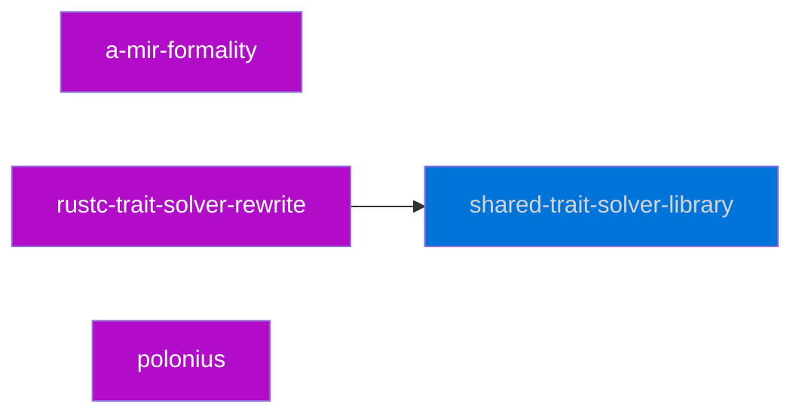

# Roadmap planning

Zulip discussion link: https://rust-lang.zulipchat.com/#narrow/stream/326132-t-types.2Fmeetings/topic/2022-10-28.20roadmap/near/306650004

# Big pieces

* formality (i.e., model)
* shared library for trait solver between rust/r-a, with intermediate steps of
    * improved diagnostics for trait system
    * refactored rustc implementation
    * Chalk?
    * rustc-type-ir/chalk-ty
* feature work (intersects both the above), such as...
    * improvements on generic associated types
    * improvements on impl Trait (e.g., TAITs, RPITIT)
    * soundness fixes, especially for higher-ranked stuff

### Formality

Key questions:
 - When to move to rust-lang org?

Goals for next year:

* testing against rustc (and chalk)
* modeling borrow check, trait solving, type checking from MIR backwards, with some elements of lowering into MIR as needed
* integrated into our language design processes (new features modeled)

Specific questions to probe:

* [erased lifetimes](https://rust-lang.zulipchat.com/#narrow/stream/326132-t-types.2Fmeetings/topic/2022-10-28.20roadmap/near/306657313)
* 

### Shared library

- Initiative? Not all of this?

### Feature work and related

What features are relevant?

- async? (how much)
    - https://github.com/rust-lang/rust/issues/60658
- RPITIT
    - lead: Niko/tmandry
    - other: Michael
- AFIT
    - lead: Niko/tmandry
    - other: Michael
- TAITs
    - lead: oli
- existential lifetime parameters for cleaner TAIT impl?
    - lead: nobody
- - GATs
    - lead: Jack
    - Subgoals:
        - Implied 'static
        - Object safety
        - `for<'a> <_ as Trait>::Assoc<'a>: OtherTrait` goals
- polonius
    - lead: Niko
    - others: lqd
- keyword generics
    - const traits
- negative trait impls
    - lead: Niko
    - others: santiago
- const eval
    - `impl Trait` interaction?
- implication types
    - lead: Jack?

### GATs

## Timelines and meetings

## Questions

### Is layout under our purview?

Seemingly no? Probably more of an opsem team thing.

### Active initiatives and planned work that goes beyond that

Can we chart it out

